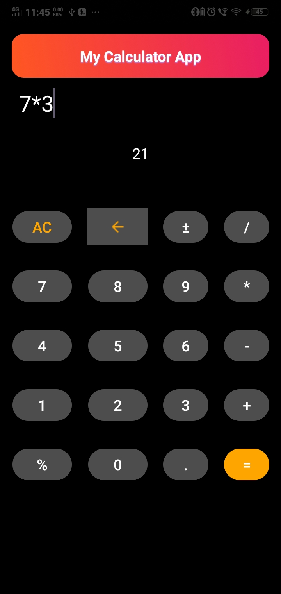

Simple Calculator App

*This project was developed to **enhance my skills in interface design using XML and to make the UI responsive with Kotlin**. It serves as a hands-on learning experience in building modern, user-friendly layouts in Android development.

*This is a basic calculator application built using Kotlin and Android Studio. It allows users to perform standard arithmetic operations like addition, subtraction, multiplication, and division. Designed with a user-friendly interface, this app serves as a great example of fundamental Android development using Kotlin.
✨ Features

   * Basic arithmetic operations: Add, Subtract, Multiply, Divide

   * Clean and intuitive UI

   * Real-time result display

   * Error handling for invalid operations (e.g., divide by zero)

   * Responsive layout for various screen sizes

🛠️ Tech Stack

   * Language: Kotlin

   * IDE: Android Studio

   * UI Components: XML layouts, Android Views

   * Logic: Kotlin functions for operation handling

